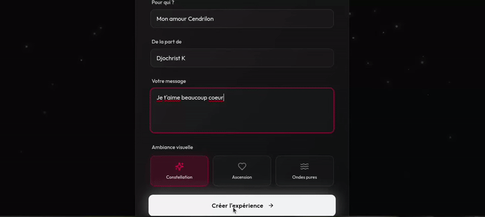

# TenderMoment

Générateur d’expériences romantiques **partageables via un lien**. L’expérience est encodée côté client et ne dépend pas d’une base de données.


## Aperçu


## Fonctionnalités
- Création d’une expérience (noms, message, ambiance visuelle)
- Partage via URL (aucun compte requis)
- API minimale (healthcheck) + serveur dev intégré

## Stack
- Frontend : React, Vite, Tailwind CSS, Framer Motion, Radix UI
- Backend (dev/prod) : Express
- Données : Drizzle ORM
- Validation : Zod
- State/data : TanStack Query
- Build : TypeScript, tsx, Vite, esbuild, PostCSS

## Prérequis
- Node.js `>= 20` (voir `.nvmrc`)
- npm

## Installation
```bash
npm ci
```
Si vous n’avez pas encore de `package-lock.json` cohérent, utilisez `npm install`.

## Développement
```bash
npm run dev
```
Serveur par défaut : `http://localhost:5000`.

## Production
```bash
npm run build
npm run start
```

## Scripts
- `npm run dev` : serveur dev
- `npm run build` : build client + bundle serveur dans `dist/`
- `npm run start` : lance le serveur en mode production
- `npm run check` : typecheck TypeScript
- `npm run db:push` : Drizzle (uniquement si vous ajoutez une DB)

## Structure
- `client/` : app React
- `server/` : API + serveur statique
- `shared/` : schémas et routes partagés
- `assets/` : médias et previews
